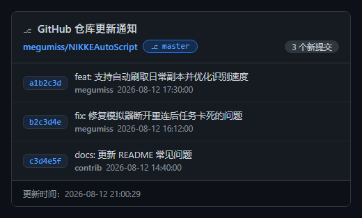
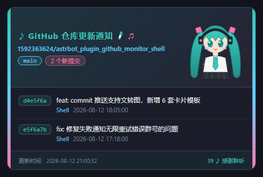
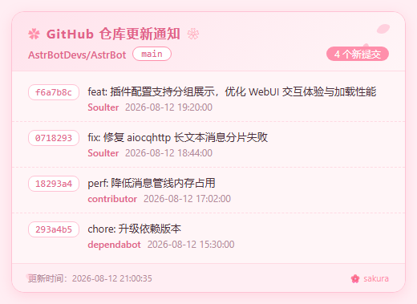

<div align="center">


[](https://opensource.org/licenses/MIT)
[](https://www.python.org/)
[](https://github.com/Soulter/AstrBot)
[](https://github.com/1592363624)

</div>

# 效果图


# 手动触发指令

/github_status  手动触发监控检查

/github_monitor  查看监控状态

# 配置说明

除了原有的配置项，现在还支持：

- `group_notification_targets`: 群通知目标，可以将通知发送到指定的群聊中
- `time_zone`: 时间显示时区（默认 `Asia/Shanghai`，即可显示为北京时间）
- `time_format`: 时间显示格式，使用 Python `strftime` 语法，默认 `%Y-%m-%d %H:%M:%S`

## 推送目标格式

`notification_targets`（私聊）、`group_notification_targets`（群聊）以及仓库配置中的 `groups` 支持两种格式：

### 传统格式

- 纯数字群号/QQ号，如 `123456`，自动匹配QQ系列平台（aiocqhttp / qq_official / qq_official_webhook）
- 以 `-` 开头的ID：Telegram 群组

### UMO 格式（推荐）

`平台ID:消息类型:会话ID`，平台无关且自带路由信息：

```
aiocqhttp:GroupMessage:123456
小爱同学:GroupMessage:0771687B325FC423AD9F4C06A88D84E3
qq_official:FriendMessage:0771687B325FC423AD9F4C06A88D84E3
```

QQ 官方机器人（qq_official / qq_official_webhook）没有传统数字群号/QQ号，只有一串十六进制的 openid 会话ID，必须使用 UMO 格式（或直接填写 openid，单平台部署时会自动匹配）。配置了多个 bot/平台时，UMO 可以明确指定由哪个平台的哪个会话接收推送。

## 仓库配置增强功能

现在支持为每个仓库单独配置通知群组：

### 字符串格式配置（推荐）

```json
"repositories": [
"owner/repo",
"owner/repo|123456|91219736"
]
```

### 字典格式配置

```json
"repositories": [
{
"owner": "owner",
"repo": "repo"
},
{
"owner": "owner",
"repo": "repo",
"groups": ["123456", "91219736"]
}
]
```

示例：

```json
"repositories": [
"1592363624/astrbot_plugin_github_monitor_shell",
"1592363624/astrbot_plugin_github_monitor_shell|123456789|91219736"
]
```

表示监控 1592363624/astrbot_plugin_github_monitor_shell 仓库，当第二个仓库有更新时，除了全局配置的群通知目标外，还会通知
123456789 和 91219736 群组。

## 文转图（Commit 图片卡片）

将 commit 更新通知渲染为图片卡片发送（依赖 AstrBot 的 T2I 文转图服务，请先在后台配置好）。以下选项均位于插件配置的「文转图（图片通知）」分组：

- `commit_output_format`: `text`（默认）或 `image`
- `commit_image_template`: 内置 `terminal`（默认）/ `github_dark` / `light` / `retro_term` / `miku` / `sakura` 6 套主题，或选 `random` 每次随机
- `enable_base64_image`: 图片传输使用 Base64 编码（默认开启；关闭则用文件路径，需协议端与 AstrBot 共享文件系统）
- `t2i_image_type` / `t2i_quality` / `t2i_scale`: 图片格式（png/jpeg）、质量、清晰度

### 模板预览

| github_dark | miku | sakura |
| :---: | :---: | :---: |
|  |  |  |

### 自定义模板

把 `.html` 文件放入插件数据目录的 `templates/` 文件夹（通常 `AstrBot/data/plugin_data/GitHub监控插件/templates/`），文件名（不含后缀）即模板名，填到 `commit_image_template` 即可使用，也会加入 `random` 的随机池。模板为 Jinja2 语法，可用变量：`title`、`repo_name`、`repo_url`、`branch`（可为 `None`）、`commit_count`、`generated_at`、`commits`（每项含 `sha_short` / `message` / `author` / `time` / `url`）。

模板需完全自包含（CSS 内联、无外部资源），并在 `<head>` 加上 `<meta name="viewport" content="width=<卡片宽度>, height=10">` 让 T2I 按内容裁剪，可参考内置 `templates/<主题>/commit_card.html`。

### 群文件 / 群相册备份上传

图片通知发送成功后可同时备份上传（仅 aiocqhttp 平台的 QQ 群）：

- `enable_group_file_upload` + `group_file_folder`: 上传到群文件指定文件夹（不存在自动创建，留空为根目录）
- `enable_group_album_upload` + `group_album_name` + `group_album_strict_mode`: 上传到群相册（NapCat 扩展 API）；严格模式下找不到指定相册会放弃上传，防止误传


## 🐔 联系作者

- **反馈**：欢迎在 [GitHub Issues](https://github.com/1592363624/astrbot_plugin_zanwo_shell/issues) 提交问题或建议
QQ群:91219736
telegram:[巅峰阁](https://t.me/ShellDFG)
